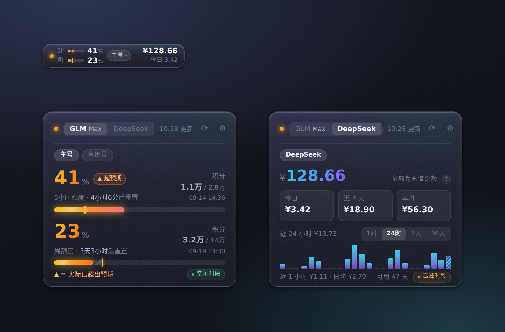
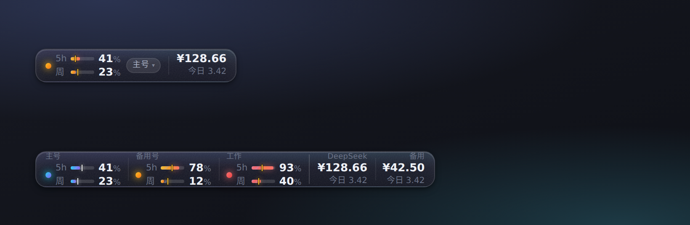
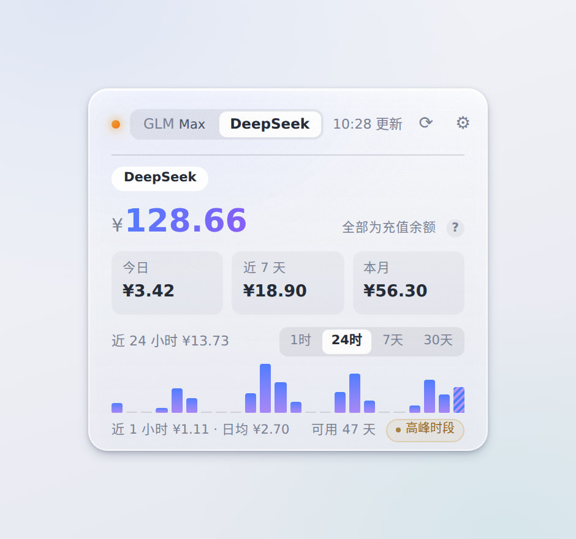
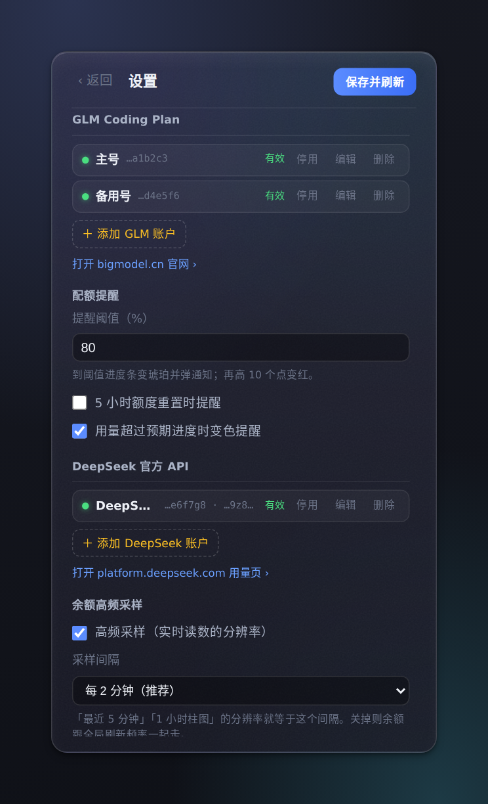
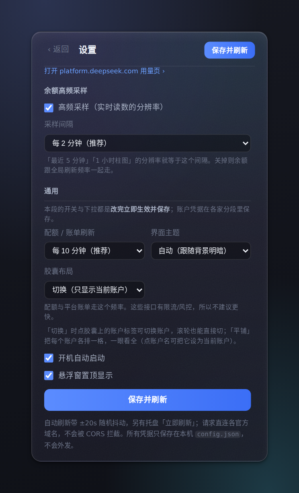

# GLM 用量挂件 · glm-quota-widget

[](https://github.com/liuxsh9/glm-quota-widget/actions/workflows/release.yml)
[](https://github.com/liuxsh9/glm-quota-widget/releases/latest)

悬挂在屏幕角落的一枚小胶囊：**GLM Coding Plan 的 5 小时 / 周额度**、**火山方舟 Coding / Agent Plan 的 5 小时 / 周 / 月额度**、**DeepSeek 的余额与消费**，扫一眼就够。点开是完整面板，每家云各自可挂**多个账户**。



<sub>左上：常驻胶囊（左 GLM 两条配额条，右 DeepSeek 余额与今日消费）· 左：GLM 面板 · 右：DeepSeek 面板。余额默认打码，点一下才显示。</sub>

## 它能做什么

- **不用打开任何窗口**：胶囊上一眼看完各条配额进度 + 余额；可拖到任意位置、始终置顶
- **预期进度**：进度条上的斜纹段 = 按时间均摊、此刻「应该」用掉的量。实际一旦超过它，超出那段直接标红、整体转琥珀提醒——账单还没到，也能提前知道自己花超了
- **多账户**：同一家云挂几个号都行。「切换」模式只显示当前号、点标签弹菜单换人；「平铺」模式每个号各占一格，一眼看全
- **面板**：GLM 给百分比 / 积分 / 重置倒计时；火山方舟给 5 小时 / 周 / 月三条窗口（Agent Plan 另有「已用 / 总量」次数）；DeepSeek 给余额、今日 / 近 7 天 / 本月消费、消费柱状图（1 小时按 5 分钟、24 小时按小时、7 / 30 天按天）、可用天数与 token 用量
- **不打扰**：余额默认打码（瞟一眼看不到价格）；深浅色背景自动换深色 / 浅色玻璃；无动画特效
- **省心**：默认 10 分钟自动刷新（带 ±20s 随机抖动、429 自动退避），单实例，托盘常驻

## 安装

到 [Releases](https://github.com/liuxsh9/glm-quota-widget/releases/latest) 下载（推 tag 自动构建），三选一：

| 文件 | 说明 |
|---|---|
| `GLM-Usage-Widget-x.y.z-win64.zip` | **推荐 · 目录版**：解压得到一层 `GLM-Usage-Widget/` 文件夹，双击里面的 `GLM-Usage-Widget.exe`，约 1 秒启动 |
| `GLM-Usage-Widget Setup x.y.z.exe` | 安装版：装进本机，带桌面快捷方式，支持开机自启 |
| `GLM-Usage-Widget x.y.z.exe` | 便携版：单文件 ~70MB，即拷即用，但每次启动都要自解压到临时目录，冷启动 5~20 秒，适合 U 盘应急 |

注意：**只有安装版和目录版能开机自启**（便携版每次解压的路径都不一样，设置里会自动置灰）。

> **第一次运行可能弹「Windows 已保护你的电脑（发布者未知）」——这是正常的。** 这个包没有买代码签名证书（开源小工具的常态），而浏览器下载会给文件打上「来自互联网」标记，Windows 见到「有标记 + 没签名」就会拦一下。
> 点「更多信息」→「仍要运行」即可；或者**解压之前**右键那个 zip → 属性 → 勾选「解除锁定（Unblock）」，解压出来的 exe 就不再弹了。
> （你自己从源码 `npm run dist:win` 出的包不带这个标记，所以不会弹——跟包的结构没关系。）

## 上手

1. 启动后点胶囊 → 进设置
2. 按提示粘贴凭据：

   | 想监控 | 需要什么 | 怎么拿 |
   |---|---|---|
   | GLM | **API Key**（推荐，长期有效） | [bigmodel.cn](https://www.bigmodel.cn/coding-plan/personal/overview) → 控制台「API Keys」→ 创建 |
   | GLM | 或登录 Cookie（约 3 天失效） | F12 → Application → Cookies → `bigmodel_token_production` |
   | DeepSeek 余额 | **API Key**（`sk-` 开头） | [platform.deepseek.com](https://platform.deepseek.com) → 「API Keys」 |
   | DeepSeek 精确账单（选配） | 平台 `userToken` | 同一站点 F12 → Application → Local Storage → `userToken` |
   | 火山方舟 | **IAM 子账号的 AK/SK** | [console.volcengine.com/iam/keymanage](https://console.volcengine.com/iam/keymanage) → 见下方「火山的权限怎么给」 |

   > **火山方舟这条特别注意：不要用主账号的 AK/SK。**
   > 它的用量接口只认火山签名（AK/SK），而 AK/SK 能签这个身份名下的**所有**管理接口——远不止查用量。
   > 正确做法是建一个**只读子账号**，给它挂两个预设策略：`ArkReadOnlyAccess`（火山方舟全局只读）+
   > `BillingCenterReadOnlyAccess`（费用中心只读），然后用子账号的 AK/SK。子账号的访问方式**只勾「编程访问」**，
   > 别给它控制台登录密码。Secret Access Key 只在创建时显示一次，丢了只能重建。

3. **保存并刷新**。剪贴板里检测到凭据时会提示一键填入；粘贴的内容认不出来时，表单会留在原地告诉你**是哪个框没认出来**（不会出现「提示保存成功、其实没加上」）

## 界面



<sub>多账户的两种胶囊布局。上=**切换**：只显示当前账户，点「主号 ▾」弹账户菜单 · 下=**平铺**：每个账户各占一格，各按自己的水位上色（青=正常、琥珀=接近阈值、红=已超标）；同一家的账户之间是内缩的浅线，两家之间是更亮的竖线。</sub>

 

<sub>左：背景是浅色时自动切浅色玻璃 · 右：设置页按「这个设置影响谁」分段，开关改完立即生效。</sub>

> 所有截图由 `python3 tools/shots.py` 生成：**全程假数据**（余额、消费、token、凭据尾号都是编的），不读任何真实凭据、不联网，时钟也钉在固定时刻，因此可复现。

## 多账户

每家可以添加任意多个账户（设置页「＋ 添加账户」），各有独立凭据、独立状态、独立消费历史。胶囊有两种布局（**设置 › 通用 › 胶囊布局**）：

- **切换**（默认）：胶囊只显示「当前账户」，数据右侧有一枚账户标签——点它弹出账户菜单，或者在胶囊上**滚轮**循环切。标签上写着当前账户名，瞟一眼就知道在看谁
- **平铺**：每个账户各占一格，格顶写账户名，一眼看全——适合「就想同时盯着几个号」。点账户名把它设为当前账户

切账户的三种方式：面板里点账户 chips、胶囊上点标签（或滚轮）、平铺模式下点账户名。



<sub>布局开关在 设置 › 通用 › 胶囊布局（配了多账户才会出现）。</sub>

颜色按**每个账户自己的水位**算：平铺时可能左边还是青的、右边已经红了。托盘图标取全局最差档位，任何一个账户凭据失效都会变红，不会被别的好状态掩盖。

**停用**（设置页账户行右侧那个按钮）＝「别再拉、也别再显示」。某家一个启用账户都不剩时，它的胶囊列、面板页签、托盘那一行**一起收掉**——不会留一列显示着停用前的旧读数；账户本身仍留在设置页，凭据不动，随时能再启用。重新启用会立刻拉一次，不用等下一个刷新周期。

## 数据从哪来

### GLM（配额百分比）

```
GET https://open.bigmodel.cn/api/monitor/usage/quota/limit
Authorization: <API Key 或 bigmodel_token_production 的 JWT>   # 注意没有 Bearer 前缀
```

与智谱官方插件 [glm-plan-usage](https://github.com/zai-org/zai-coding-plugins) 同源的官方接口。返回两条 `CREDIT_LIMIT`：带 `unit`/`number` 字段时按窗口时长区分（3 = 小时×number → 5 小时额度，6 = 周 → 周额度），老响应缺字段时退回「`nextResetTime` 早的那个是 5 小时额度」。

### DeepSeek（余额 / 消费）

两条**互相独立**的链路，各配各的、各降各的级：

| 链路 | 凭据 | 有效期 | 拿到什么 | 刷新频率 |
|---|---|---|---|---|
| 余额 | `sk-` API Key | 长期 | 账户余额、充值/赠送拆分 | **单独每 2 分钟**（可调 1/2/5/10 分钟或关闭） |
| 精确账单 | 平台 `userToken`（选配） | 短，会过期 | 逐日消费、本月账单、逐模型 token 与缓存命中率 | 跟主刷新频率（默认 10 分钟） |

平台账单最细只到「天」，所以「最近 5 分钟」「近 1 小时」「24 小时按小时」这类实时读数一律由**余额差值**算出——分辨率就等于余额刷新频率（默认 2 分钟）。余额是唯一的实时信号源。

**只配 API Key 也能用**：消费由本机余额差值推算（相邻两次采样余额下降即消费、上升即充值），但挂件没运行的时段补不回来，整段差额会并入下一次采样那天——刚装上时「近 7 天 / 本月」会偏少，跑几天才准。配了平台令牌就改用官方账单口径，立刻有完整历史（含上月，用于补全近 30 天）。

### 火山方舟（Coding Plan / Agent Plan 配额）

两个接口都是**控制面 OpenAPI**（`open.volcengineapi.com`，不是推理域名 `ark.cn-beijing.volces.com`），强制**火山引擎签名 V4（AK/SK）**——复用推理用的 Bearer API Key 会被网关拒。

| 套餐 | Action | 返回 |
|---|---|---|
| Coding Plan | `GetCodingPlanUsage` | **只有百分比**，拿不到「已用 / 总量」 |
| Agent Plan | `GetAgentPlanAFPUsage` | 有绝对值：已用 / 总量 / 重置时间 |

两边都是三条窗口（5 小时 / 周 / 月），额度按**调用次数**计——不是 token，也不是 GLM 那种积分。

**「套餐」那一栏什么时候要改**：默认「自动识别」——先查 Coding Plan，没订阅再退到 Agent Plan，一个账号配一次就不用管了。同一个账号**两种都订阅了**时，自动识别只显示 Coding Plan（面板脚注会提示），这时**再加一个账户**、填同一对 AK/SK，把套餐固定成 Agent Plan——一个账户盯一种套餐，互不干扰。

**两个接口都不给窗口开始时间**，只给下次重置时间，所以进度条上那条「预期进度」的斜纹段是由「重置时间 − 窗口长度」倒推的。网络错误、限流、权限不足时**不会**去试另一种套餐（那会把「查不到」误报成「没订阅」），只有明确返回「未订阅」才会回退。

**胶囊上那格只有两行**：`5h` 和 `周` 带进度条，`月` 只给数字跟在「周」那一行后面——三条窗口排三行会把行距压扁，还会把整枚胶囊顶高（比 GLM / DeepSeek 那两格高出一截）。月额度涨得慢，条形给不出更多信息，数字够用；万一看得出「月超预期」，那个数字会变琥珀。要看完整的一条去面板。

### 峰谷时段（两家规则不同，均以北京时间 UTC+8 为准）

| | 高峰时段 | 空闲时段的优惠 |
|---|---|---|
| **DeepSeek** | 周一至周五 09:00–12:00、14:00–18:00 | 空闲时段价格是高峰的**一半**，周末全天按低谷价 |
| **GLM Coding Plan** | 周一至周五 14:00–18:00 | 按**更低的积分系数**抵扣，倍率随模型而变（如 GLM-5.3 非高峰 1 倍 / 高峰 3 倍）。所以界面上只报时段、不写死折扣 |

其余时间都是空闲时段。注意 **GLM 的高峰是 DeepSeek 的子集**：工作日上午 9–12 点只有 DeepSeek 贵。

火山方舟的套餐**按调用次数计费，不分峰谷**，所以它面板上那一格恒为「—」。

## 设置

设置页按「这个设置影响谁」分三段，内容可滚动：

| 段 | 放什么 |
|---|---|
| **GLM Coding Plan** | 账户列表（添加 / 编辑 / 停用 / 删除，带状态点与凭据尾号）；配额提醒（阈值、重置提醒、超预期变色）；官网入口 |
| **DeepSeek 官方 API** | 账户列表（每账户含 API Key + 选配平台令牌）；余额高频采样；用量页入口 |
| **火山方舟 Coding / Agent Plan** | 账户列表（每账户含 AK/SK + **套餐**下拉）；控制台入口 |
| **通用** | 刷新频率、界面主题、**胶囊布局**、开机自启、窗口置顶（胶囊布局只在配了多账户时出现） |

配额提醒（阈值 / 重置提醒 / 超预期变色）是**全局一份**，挂在 GLM 那一段下面，对 GLM 与火山方舟同时生效。

**保存行为**：开关与下拉**改完立即生效**（右上角闪一下「✓ 已保存」）；凭据在「添加 / 编辑」表单里显式保存。凭据粘贴格式不对时会明确报错并保留旧值，不会静默丢弃。

**快捷操作**：胶囊单击 = 展开面板，右键 = 菜单，拖动 = 换位置；展开态拖动任意处 = 移动、点空白处 = 收起、`Ctrl+滚轮` = 等比缩放（80%–160%，`Ctrl+0` 复位）、`Esc` = 收起；托盘左键 = 展开 / 收起；胶囊被拔插屏 / 睡眠唤醒搞丢时，托盘菜单 →「找回窗口」把它拉回主屏（不用重启）。

## 隐私

凭据只存在本机 `%APPDATA%\GLM 用量挂件\config.json`，明文不出主进程（界面只用尾号回显）；请求直连上述官方域名，不经任何第三方。

## 已知边界

- GLM 的 Cookie JWT 约 3 天失效（API Key 长期有效），挂件靠接口返回判定并提醒
- DeepSeek 余额是**账号级**的：同账号下所有 Key、所有客户端的消耗都算进同一份余额
- DeepSeek 平台账单是**私有接口**（非公开契约），字段可能随官网改版变化；解析失败只降级这一路。它按 UTC 日界切天，「今日」在北京时间 08:00 前后会有一次跳变
- 未配平台令牌时的消费推算依赖挂件运行，历史样本保留 90 天（`ds-history.json`）
- 火山方舟的**Coding Plan 只返回百分比**，看不到「已用 / 总量」（面板那一行留空）；Agent Plan 才有绝对值
- 火山套餐额度按**调用次数**计，不是 token；也不分峰谷
- 火山的「5 小时」窗口按**固定档期**假设（窗口开始 = 重置时间 − 5 小时）。若官方实际是随用随滑的窗口，进度条的「预期」会偏乐观——这条等有真实账号后校准
- 火山凭据是**账号级 AK/SK**（务必用只读子账号，见「上手」），权限比一个 API Key 大得多；挂件只是照常明文存在本机 config.json 里
- 多显示器以主显示器工作区为定位基准：拔屏只对被拔的那块屏派发 `display-removed`、插屏只派发 `display-added`（幸存屏度量没变时没有 `display-metrics-changed`），而且多屏事件是**错峰到达**的，所以三个事件统一走 300ms 防抖，落定后把窗口收回工作区；睡眠唤醒锁屏解锁后还会再自检两次（睡眠期间的插拔常常一个事件都收不到）。面板宽 326 固定，**高度按实测内容上报**：GLM 与 DeepSeek 取两者里高的那个（所以这两页之间切来切去窗口一像素都不动），火山方舟那页多一个「月」块、比它们高一截，进 / 出那一页时窗口会跟着变高变矮
- 万一窗口还是没出现（例如解锁后它落在一块黑着的屏上），托盘菜单 →「找回窗口」重置位置并强制拉回主屏右上角
- 「近 1 小时」「5 分钟柱」的分辨率 = 余额刷新频率（默认 2 分钟）；关掉高频采样时最细那档基本画不出东西

## 开发

```bash
npm install             # 已配 npmmirror 镜像
npm start               # 本地运行（F12 开 DevTools）
npm run test:usage      # GLM 数据层（真实 token 走 GLM_TOKEN 或 /tmp/glm_token）
npm run test:deepseek   # DeepSeek 数据层（真实联测走 DS_API_KEY）
npm run test:volc       # 火山方舟签名与解析（签名对官方 Python SDK 的黄金向量）
npm run test:providers  # provider 注册表与各家实现（全 mock，不连网）
npm run test:main       # 主进程集成：桩掉 electron 真实加载 main.js，验迁移/CRUD/窗口尺寸联动
npm run test:renderer   # 渲染层交互（需 python3 + playwright）
npm run test:drag       # 拖拽几何
npm run test:artifacts  # 打包钩子：在临时目录真打一份 zip，验里面套了 GLM-Usage-Widget/ 一层
npm run icon            # 重新生成图标
python3 tools/shots.py  # 重新生成 README 截图（假数据）
npm run dist:win        # 打包 Windows 安装版 + 便携版（Linux 上出安装版需要 wine）
```

> 真实凭据一律走环境变量（`GLM_TOKEN` / `DS_API_KEY` / `/tmp/glm_token`），代码与测试里不出现明文。

**目录**

```
main.js               主进程：窗口 / 托盘 / 定时刷新 / 通知 / 配置 + 按账户的刷新与轮询编排
preload.js            contextBridge 桥（含账户 CRUD）
lib/providers/        ★ provider 注册表：meta.js（凭据声明 / 强调色 / 专栏兜底宽度，双端共用）
                        + glm.js / deepseek.js / volc.js 实现 + quota-alerts.js（配额型共用提醒）
                        + index.js
lib/usage.js          GLM 配额请求与解析（纯 Node，可独立测试）
lib/volc.js           火山方舟签名 V4 + 两种套餐的请求与归一化（纯 Node，可独立测试）
lib/deepseek.js       DeepSeek 余额 + 平台账单两条链路
lib/tokens.js         三种凭据的提取规则（UMD，主进程与渲染层共用）
lib/ds-history.js     余额差值历史：样本抽稀、逐日 / 逐小时聚合、实时读数（按账户分桶）
lib/format.js         万 / 千分位 / 倒计时 / 金额 / token 格式化（双端共用）
lib/drag.js           拖拽几何（主进程独占光标坐标系）
renderer/             app.js 编排 + panes.js（各 provider 的胶囊列 / 面板视图）+ settings.js（账户管理）
tools/                图标生成 / 截图脚本
```

**加一家新 provider**：`meta.js` 加一条元数据 → `lib/providers/<id>.js` 写 fetch 实现 → `index.js` 注册一行 → **在 `renderer/panes.js` 加一个工厂并注册进 `window.PANES`**。设置页分段、账户管理、面板页签、阈值提醒（`lib/providers/quota-alerts.js`）、凭据剪贴板识别都自动出现，`main.js` 不用改（只有托盘提示那一处是按 provider 写的 if/else，要补一支）。

> **没有「通用视图」兜底**：`window.PANES` 里缺了这一家，页签和设置页都在，但胶囊上不会出现这一列、面板里是空的。另外元数据与实现要**同一次落地**——渲染层读的是未经注册表过滤的元数据，只加 meta 会多出一个点了报「未知 provider」的「＋ 添加账户」按钮。

现成的三家可以直接抄：`glm.js`（最简：百分比配额）、`volc.js`（AK/SK 签名 + 三个窗口 + 枚举型凭据字段）、`deepseek.js`（两条链路各自降级 + 余额高频采样）。

**打包的两个收尾钩子**（`build/`）：`afterPack.js` 裁掉用不到的运行时组件（dxcompiler / dxil / elevate）；`afterArtifacts.js` 把 Windows 的 zip 重打成「解压一层 `GLM-Usage-Widget/` 文件夹」并改名 `-win64.zip`——electron-builder 26 的 zip 目标在 Windows 上写死了不套目录（`ArchiveTarget.js` 里的 `withoutDir = !isMac`），只能在产物出来后用自带的 7za 按同一套参数重打一遍。

**排查**：日志和配置都在 `%APPDATA%\GLM 用量挂件\`（托盘 / 胶囊右键 →「打开日志文件夹」直达）。`main.log` 记了启动链路、每次 IPC、刷新结果和渲染层报错（环形截断 256KB），反馈问题直接贴它就行。
