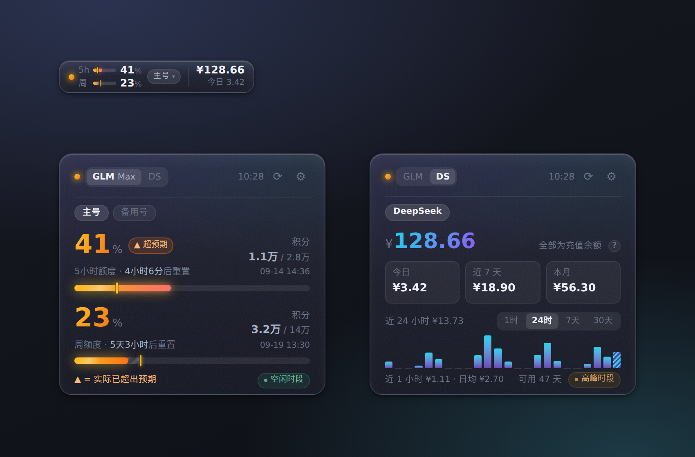

#  GLM 用量挂件

[](https://github.com/liuxsh9/glm-quota-widget/actions/workflows/release.yml)
[](https://github.com/liuxsh9/glm-quota-widget/releases/latest)
[](LICENSE)

挂在屏幕角落的一枚小胶囊：**GLM Coding Plan**、**火山方舟**、**OpenAI Codex** 的套餐额度，加上 **DeepSeek** 的余额与消费，扫一眼全知道。点开是完整面板；每家云都能挂多个账户。



<sub>左上 = 胶囊（四家各一列，GLM 两个号）· 中 = GLM / Codex 面板 · 右 = 贴边列，悬停圆圈弹出该账户的详情卡片（图里是 DeepSeek）。</sub>

## 它能做什么

- **不用打开任何窗口**：胶囊上一眼看完各条配额进度 + 余额；可拖到任意位置、始终置顶
- **预期进度**：进度条上的斜纹段 = 按时间均摊、此刻「应该」用掉的量——实际一旦超过它，超出那段标红、整体转琥珀提醒，账单还没到也能提前知道自己花超了
- **多账户**：同一家云挂几个号都行。「切换」模式只显示当前号、点标签换人；「平铺」模式每个号各占一格，一眼看全
- **完整面板**：GLM 给百分比 / 积分 / 重置倒计时；火山方舟与 Codex 给 5 小时 / 周 / 月三条窗口；DeepSeek 给余额、今日 / 近 7 天 / 本月消费、消费柱状图与可用天数
- **贴边模式**：把挂件拖到屏幕左 / 右边缘松手 → 收成一列圆圈（每个启用账户一个），环色随百分比连续渐变，鼠标悬停圆圈弹出该账户的详情卡片
- **安静省心**：余额默认打码（瞟一眼看不到价格）；深浅色背景自动换玻璃；默认 10 分钟自动刷新（带随机抖动与限流退避）；单实例，托盘常驻

## 安装

支持 Windows 10 / 11（x64）。到 [Releases](https://github.com/liuxsh9/glm-quota-widget/releases/latest) 下载（推 tag 自动构建），三选一：

| 文件 | 说明 |
|---|---|
| `GLM-Usage-Widget-x.y.z-win64.zip` | **推荐 · 目录版**：解压得到一层 `GLM-Usage-Widget/` 文件夹，双击里面的 `GLM-Usage-Widget.exe`，约 1 秒启动 |
| `GLM-Usage-Widget Setup x.y.z.exe` | 安装版：装进本机，带桌面快捷方式，支持开机自启 |
| `GLM-Usage-Widget x.y.z.exe` | 便携版：单文件 ~70MB，即拷即用，但每次启动都要自解压到临时目录，冷启动 5~20 秒，适合 U 盘应急 |

> 只有安装版和目录版能开机自启（便携版每次解压的路径都不一样，设置里会自动置灰）。

> **第一次运行可能弹「Windows 已保护你的电脑（发布者未知）」——这是正常的**：这个包没买代码签名证书（开源小工具的常态），而浏览器下载会给文件打上「来自互联网」标记。
> 点「更多信息」→「仍要运行」即可；或者**解压之前**右键那个 zip → 属性 → 勾选「解除锁定（Unblock）」，解压出来的 exe 就不再弹了。

## 上手

1. 启动后点胶囊 → 进设置
2. 按提示粘贴凭据：

   | 想监控 | 需要什么 | 怎么拿 |
   |---|---|---|
   | GLM | **API Key**（推荐，长期有效） | [bigmodel.cn](https://www.bigmodel.cn/coding-plan/personal/overview) → 控制台「API Keys」→ 创建 |
   | GLM | 或登录 Cookie（约 3 天失效） | F12 → Application → Cookies → `bigmodel_token_production` |
   | DeepSeek 余额 | **API Key**（`sk-` 开头） | [platform.deepseek.com](https://platform.deepseek.com) → 「API Keys」 |
   | DeepSeek 精确账单（选配） | 平台 `userToken` | 同一站点 F12 → Application → Local Storage → `userToken` |
   | 火山方舟 | **IAM 只读子账号的 AK/SK** | [console.volcengine.com/iam/keymanage](https://console.volcengine.com/iam/keymanage) → 见下方警告 |
   | OpenAI Codex | Codex CLI 的 **`~/.codex/auth.json`**；Codex 登录在本机就选「读本机」 | 见[数据来源](docs/internals.md) |

   > **火山方舟这条特别注意：不要用主账号的 AK/SK。** 它的用量接口只认火山签名（AK/SK），而 AK/SK 能签这个身份名下的**所有**管理接口——远不止查用量。
   > 正确做法：建一个**只读子账号**（访问方式只勾「编程访问」、不给控制台密码），挂 `ArkReadOnlyAccess`（火山方舟只读）+ `BillingCenterReadOnlyAccess`（费用中心只读）两个预设策略，再用它的 AK/SK。

3. **保存并刷新**。剪贴板里检测到凭据时会提示一键填入；粘贴的内容认不出来时，表单会留在原地告诉你**是哪个框没认出来**。

## 更多

- [使用细节](docs/manual.md)：多账户、贴边模式、设置、快捷操作、峰谷时段、已知边界
- [数据来源与开发](docs/internals.md)：四家接口与解析口径、隐私、开发与打包

## 开发

```bash
npm install && npm start   # 本地跑起来（F12 开 DevTools）
npm run test:main          # 其余测试见 package.json
```

> 真实凭据一律走环境变量（`GLM_TOKEN` / `DS_API_KEY` / `/tmp/glm_token`），代码与测试里不出现明文。目录结构、加新 provider、打包细节见[数据来源与开发](docs/internals.md)。

## 隐私

凭据只存在本机 `%APPDATA%\GLM 用量挂件\config.json`，明文不出主进程（界面只用尾号回显）；请求直连各家官方域名，不经任何第三方。

## License

MIT © liuxsh9
